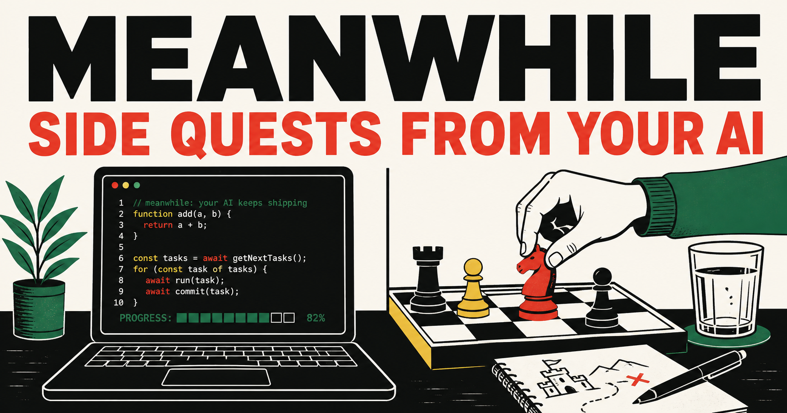

# Meanwhile

**Side quests from your AI.**

Meanwhile gives a person one fitting, finite thing to do while a coding agent keeps working: a no-tab micro quest, relevant learning, a small game, a reset, or a useful reality check.

## Product thesis

When the agent is busy, the human should get one optional invitation—not another dashboard to operate. Meanwhile is a skill plus a static website: the host agent chooses and sends the quest, while the site provides a browsable catalogue, pack pages, guides, and share cards.

It is not a separate agent, account, streak system, completion tracker, callback requirement, or human-in-the-loop work queue.



## Launch status

- Website target: <https://vaddisrinivas.github.io/meanwhile/> (verify after the first GitHub Pages deployment).
- Repository target: <https://github.com/vaddisrinivas/meanwhile> (public launch pending).
- Demo video: `NOT_CREATED`; see [`launch/FRAMECRAFT_STORYBOARD.md`](launch/FRAMECRAFT_STORYBOARD.md) for the complete production handoff.

## Install

Requires Node.js 22 or newer.

```sh
npm run build
npm run check
node scripts/install.mjs --target all --scope user
```

Dry run:

```sh
node scripts/install.mjs --target all --scope user --dry-run
```

The universal Agent Skills copy at `~/.agents/skills/meanwhile` supports Codex, Cursor, Gemini CLI, OpenCode, and GitHub Copilot. Claude Code reads `~/.claude/skills/meanwhile`. Project-only installation is also available:

```sh
node scripts/install.mjs --target all --scope project --project-dir /path/to/project
```

## Behavior and restraint

1. The agent keeps doing the main task.
2. `micro` is only for an opted-in 45–120 second wait; `journey` needs at least five unattended minutes.
3. The skill offers exactly one quest, at most once per session.
4. It declines during active debugging, urgency, sensitive actions, required input, or focused work.
5. After an ignored or declined offer, it does not retry that session; repeated declines disable implicit offers until explicit opt-in.
6. It sends a direct resource when one exists, or the prompt in chat. Play and recovery need no reply.
7. It infers an outcome only from the next chat message and never treats a click, open tab, elapsed time, or screenshot as completion proof.

## Website

- `/` — self-contained catalogue with embedded JSON.
- `/quests.json` — canonical machine-readable catalogue.
- `/packs/<pack-id>/` — seven curated packs.
- `/guides/<topic>/` — five search-oriented guides.
- `/share/?quest=<id>` — optional local share-card maker.
- `/go/?id=<quest-id>` — static ID-to-destination redirect.
- `/schema.json` — catalogue schema.

## Architecture

```text
quests.json                         Catalogue source
guides.json                         Guide source
schema.json                         Catalogue schema
src/*.template.html                 Static page templates
scripts/build.mjs                   Generator
scripts/validate.mjs                Dependency-free validator
scripts/install.mjs                 Cross-agent installer
meanwhile/SKILL.md                  Canonical behavior contract
.agents/skills/meanwhile/           Generated universal skill copy
.github/workflows/pages.yml         GitHub Pages deployment
launch/                             Launch copy and video handoff
```

The optional Cloudflare Worker is intentionally not part of this launch repository. GitHub Pages mode remains fully static.

## Privacy

GitHub Pages mode has no account, cookies, analytics, callback, fingerprinting, completion tracking, or user/session data collection. The catalogue is static JSON. Do not add advertising, affiliate links, cross-site identifiers, streaks, completion events, or sponsored quest ranking.

## Contribute

Read [`CONTRIBUTING.md`](CONTRIBUTING.md), edit the catalogue or templates, then run:

```sh
npm run check
node scripts/check-links.mjs
```

Open a focused pull request or use the [new quest issue form](https://github.com/vaddisrinivas/meanwhile/issues/new?template=new-quest.yml). Keep quests finite, optional, respectful, and honest about what they prove.

## License

MIT. See [`LICENSE`](LICENSE).
